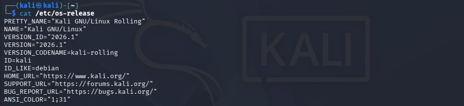
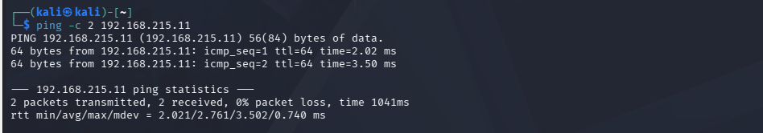

# 01 - Configuración de Kali Linux

Este documento describe la configuración base de la máquina Kali Linux utilizada en el laboratorio de ciberseguridad.

---

## 🖥️ Información del sistema

- **Versión de Kali:** Kali GNU/Linux Rolling (2026.1)
- **Tipo de instalación:** Máquina virtual preconfigurada de Kali (imagen oficial de Offensive Security)
- **Recursos asignados:**
  - RAM: 6144 MB
  - CPU: 2 procesadores
  - Disco:  40 GB 

---

## 🌐 Configuración de red

La máquina Kali utiliza una configuración de red dual para permitir acceso a internet y comunicación interna con el servidor Ubuntu.

- **Modo de red:** NAT + Host-Only
- **Interfaz NAT (eth0):**
  - IP: 10.0.2.15
- **Interfaz Host-Only (eth1):**
  - IP asignada: 192.168.215.10/24
- **Comunicación con Ubuntu:**
  - Verificada mediante `ping` hacia 192.168.215.11 (Ubuntu-server-arc)
  - Conectividad estable y bidireccional

---

## 🔧 Herramientas base instaladas

Kali incluye una gran cantidad de herramientas preinstaladas.  
Para este laboratorio se consideran esenciales:

- Nmap  
- Net-tools  
- Git  
- Curl  
- Wget  

*(Si se instalan herramientas adicionales, se documentarán aquí.)*

---

## 📸 Evidencias
 
- Salida de `ip a`

- Salida de `cat /etc/os-release`

- Prueba de ping hacia Ubuntu

---

## Notas adicionales

- Máquina utilizada como estación principal de pentesting.  
- Acceso SSH hacia Ubuntu configurado y probado.  
- Configuración estable y lista para proyectos del laboratorio.  