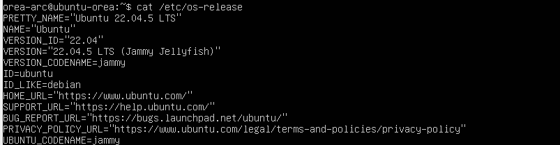
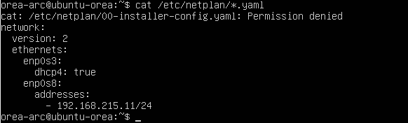
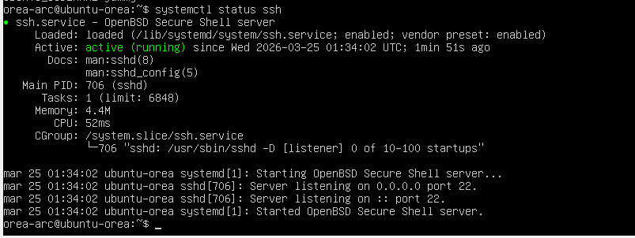

# 02 - Configuración de Ubuntu Server (ubuntu-orea)
Este documento describe la configuración base del servidor Ubuntu utilizado en el laboratorio de ciberseguridad. Incluye información del sistema, configuración de red mediante Netplan, estado del servicio SSH, pruebas de conectividad y evidencias.

---

# 🖥️ Información del sistema

Sistema operativo: Ubuntu 22.04.5 LTS (Jammy Jellyfish)  
RAM asignada: 6 GB  
CPU: 2 vCPU  
Disco virtual: 25 GB  
Hostname: ubuntu-orea  
Usuario principal: orea-arc  

### 📄 Verificación del sistema operativo

# 🌐 Configuración de red (Netplan)

El servidor Ubuntu utiliza dos interfaces de red:

- **enp0s3 (NAT):** DHCP habilitado  
- **enp0s8 (Host‑Only):** IP estática `192.168.215.11/24`  

Esta configuración permite:

- Acceso a internet mediante NAT  
- Comunicación directa con Kali Linux (`192.168.215.10`) mediante Host‑Only  

---

## 📄 Archivo Netplan

# 🔐 Servicio SSH

El servicio SSH se encuentra:

- Instalado  
- Habilitado  
- Activo (running)  
- Escuchando en IPv4 e IPv6  
- Aceptando conexiones desde Kali Linux (192.168.215.10)  

## 📄 Verificación del servicio

# 🔄 Conectividad con Kali

La comunicación entre ambas máquinas fue verificada mediante la red Host‑Only:

- **Kali Linux:** 192.168.215.10  
- **Ubuntu Server:** 192.168.215.11  

## 📄 Prueba de ping desde Kali

# 🧰 Herramientas instaladas

Ubuntu cuenta únicamente con las herramientas base del sistema.  
No se han instalado paquetes adicionales en esta fase inicial.

---

# 📌 Estado general

El servidor **ubuntu-orea** está completamente funcional dentro del laboratorio:

- Red configurada correctamente  
- SSH operativo  
- Conectividad con Kali confirmada  
- Evidencias integradas  
- Configuración validada y operativa para uso en entornos de laboratorio  