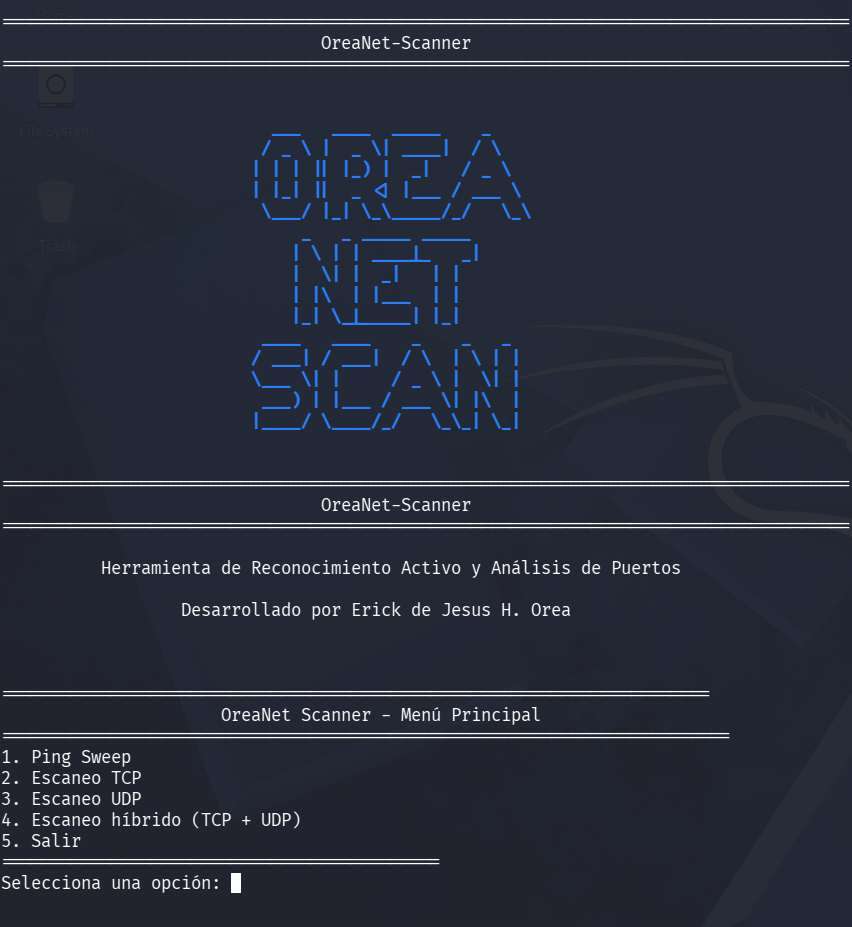
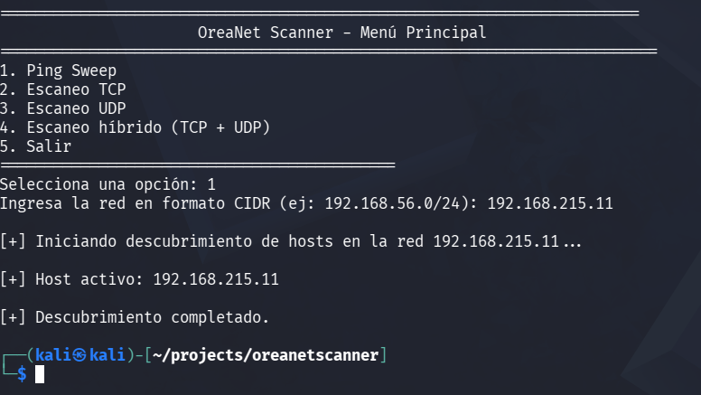
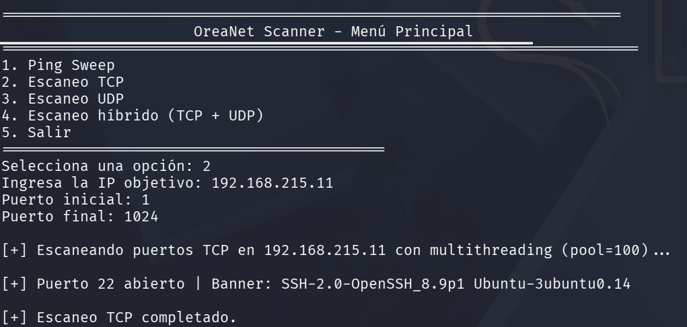
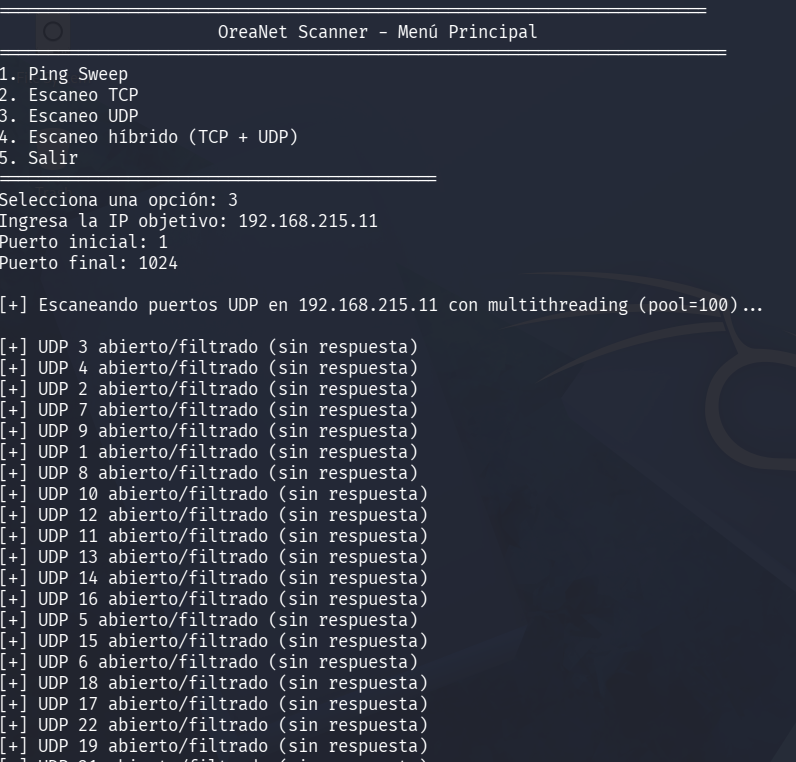
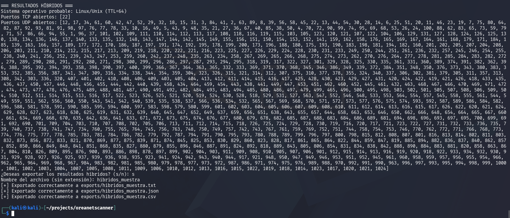
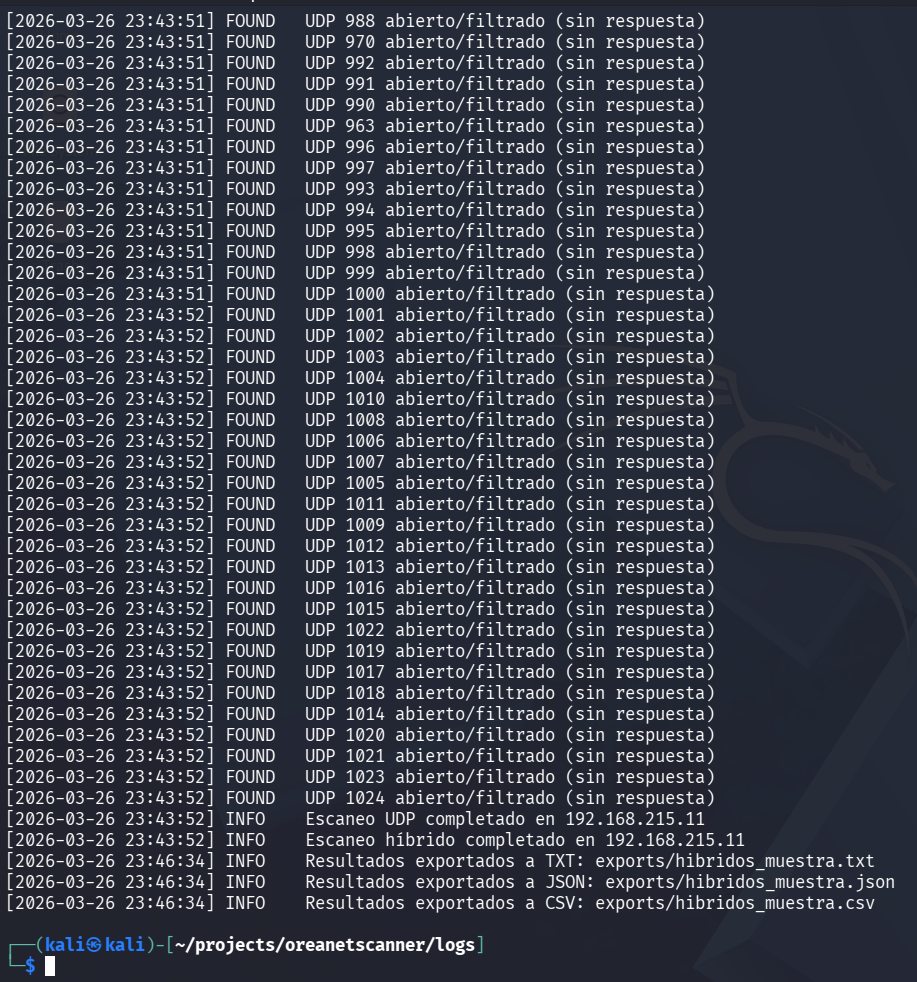
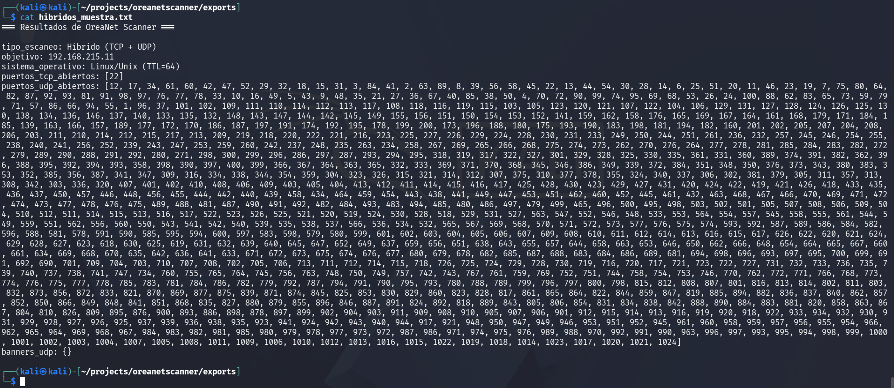

# 📘 OreaNet Scanner  
### Herramienta de Reconocimiento Activo y Análisis de Puertos  
**Autor:** Erick de Jesús Hernández Orea  

---

## 1. Descripción General

**OreaNet Scanner** es una herramienta profesional de reconocimiento activo diseñada para:

- análisis de red,  
- auditorías básicas de seguridad,  
- prácticas de ciberseguridad,  
- formación en protocolos y puertos.

Permite identificar hosts activos, detectar puertos abiertos, obtener banners de servicios, analizar puertos UDP y realizar fingerprinting básico del sistema operativo mediante TTL.

Este proyecto forma parte de un portafolio profesional orientado a roles de **TI** y **Ciberseguridad Jr.**

---

## 2. Vista General de la Herramienta



---

## 3. Características Principales

### 🔹 Ping Sweep
- Descubrimiento de hosts activos mediante ICMP.
- Compatible con redes en formato CIDR.



---

### 🔹 Escaneo TCP
- Detección de puertos abiertos.
- Banner grabbing automático.
- Multithreading con ThreadPool (100 hilos).



---

### 🔹 Escaneo UDP
- Identificación de puertos abiertos/filtrados.
- Recepción de banners cuando es posible.



---

### 🔹 Escaneo Híbrido (TCP + UDP + OS)
- Fingerprinting básico del sistema operativo (TTL).
- Resultados combinados en un solo reporte.



---

### 🔹 Logging Profesional



---

### 🔹 Exportación de Resultados



Formatos soportados:
- `.txt`
- `.json`
- `.csv`

---

## 4. Tecnologías y Conceptos Clave

- **Python 3**
- **Sockets**
- **TCP / UDP / ICMP**
- **ThreadPoolExecutor**
- **TTL para OS Fingerprinting**
- **Logging**
- **Exportación estructurada**

---

## 5. Estructura del Proyecto

```
/src
    oreanet_scanner.py
    logger.py
    exporter.py

/docs
    technical.md
    user_guide.md
    01-kali.configuration.md
    02-ubuntu.configuration.md
    /screenshots
        menu.png
        ping_sweep.png
        tcp_scan.png
        udp_scan.png
        hybrid_scan.png
        logs.png
        exports.png

/logs
    .gitignore

/exports
    .gitignore

README.md
LICENSE
```

---

## 6. Instalación

### Requisitos
- Python 3.10+
- Linux (Kali recomendado)
- Permisos para ejecutar `ping`

### Instalación
```bash
git clone https://github.com/Erick-Orea/OreaNetScanner.git
cd oreanetscanner
```

### Ejecución
```bash
python3 src/oreanet_scanner.py
```

---

## 7. Ejemplos de Uso

### Ping Sweep
```
1. Ping Sweep
Ingresa la red: 192.168.1.0/24
```

### Escaneo TCP
```
2. Escaneo TCP
IP objetivo: 192.168.1.10
Rango: 1–1024
```

### Escaneo UDP
```
3. Escaneo UDP
IP objetivo: 192.168.1.10
Rango: 1–1024
```

### Escaneo Híbrido
```
4. Escaneo híbrido (TCP + UDP)
```

---

## 8. Arquitectura Interna

- **oreanet_scanner.py** → Control principal y lógica del menú  
- **logger.py** → Sistema de logging  
- **exporter.py** → Exportación TXT/JSON/CSV  
- **ThreadPoolExecutor** → Concurrencia estable y eficiente  

---

## 9. Autor

**Erick de Jesús Hernández Orea**  
TI & Cybersecurity Jr.  
Desarrollador de herramientas de seguridad y automatización.

---

## 10. Licencia

Este proyecto está bajo la licencia **MIT**.
